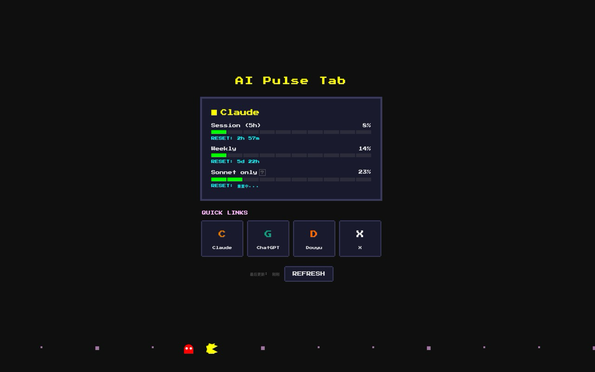

# AI Pulse Tab

A Chrome extension that displays your Claude AI usage quota on the new tab page, styled with a retro Pac-Man pixel art theme.



## Features

- Real-time Claude usage quota display (Opus, Sonnet, Haiku)
- Quota bar with color-coded thresholds (green → yellow → red)
- Reset countdown timer
- Quick links to Claude and other AI tools
- Pac-Man pixel art decorations
- Auto-refresh every 5 minutes via background alarms
- All data stays local — no external data collection

## Install

```bash
pnpm install
```

## Development

```bash
pnpm dev          # Chrome
pnpm dev:firefox  # Firefox
```

## Build

```bash
pnpm build        # Chrome
pnpm zip          # Package as .zip for Chrome Web Store
```

## How It Works

The extension reads your `claude.ai` session cookie locally to fetch usage data from Claude's API. Usage data is cached in `chrome.storage.local` and refreshed periodically via `chrome.alarms`. No data is ever sent to third-party servers.

## Privacy

See [PRIVACY.md](PRIVACY.md) for the full privacy policy.

## License

MIT
